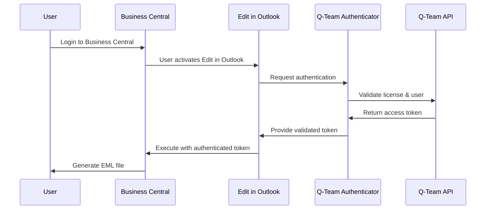

# Authentication

This page describes the authentication system of Edit in Outlook and how it integrates with Q-Team App Authenticator and Business Central security.

## Authentication Overview

Edit in Outlook uses a multi-layer authentication approach that ensures security at various levels:

1. **Business Central User Authentication**
2. **Q-Team App Authenticator Integration**  
3. **Office 365 / Outlook Integration**
4. **Browser Security Context**

## Q-Team App Authenticator

### Dependencies & Setup

#### Required Dependency
Edit in Outlook depends on Q-Team App Authenticator:
```json
{
  "dependencies": [
    {
      "id": "40b4698b-83a8-4780-a29d-ff0103191f89",
      "publisher": "Q-Team Solutions",
      "name": "Q-Team App Authenticator", 
      "version": "27.0.46044.0"
    }
  ]
}
```

#### Authenticator Setup Process
1. **Install Q-Team App Authenticator** (automatic with Edit in Outlook)
2. **Configure License Key**:
   ```al
   // Via Setup Page
   QTeamAuthSetup.Get();
   QTeamAuthSetup."License Key" := 'YOUR_LICENSE_KEY';
   QTeamAuthSetup."Customer No." := 'CUSTOMER_ID';
   QTeamAuthSetup.Modify();
   ```
3. **Test Connection**: Verify authenticator works correctly
4. **Enable Auto-Refresh**: For automatic token renewal

### Authentication Flow

#### Token-Based Authentication


#### Token Lifecycle
| Phase | Duration | Description |
|--------|----------|-------------|
| **Generation** | - | Token created by Q-Team API |
| **Active** | 60 minutes | Token valid for operations |
| **Refresh Warning** | 55 minutes | System warns of upcoming expiry |
| **Auto-Refresh** | 59 minutes | Automatic token renewal |
| **Expired** | 60+ minutes | Token invalid, re-auth required |

## Business Central User Authentication

### User Rights & Permissions

#### Permission Sets Integration
Edit in Outlook respects BC user rights:

```al
// Permission verification example
procedure VerifyUserPermissions(DocumentType: Enum "Document Type"; DocumentNo: Code[20]): Boolean
var
    RecRef: RecordRef;
    UserPermissions: Codeunit "User Permissions";
begin
    // Get document record
    case DocumentType of
        DocumentType::Quote:
            RecRef.Open(Database::"Sales Header");
        DocumentType::Order:
            RecRef.Open(Database::"Sales Header");
        DocumentType::Invoice:
            RecRef.Open(Database::"Sales Invoice Header");
    end;
    
    // Check read permissions
    if not UserPermissions.HasReadPermission(RecRef.Number) then
        exit(false);
        
    // Check specific document access
    RecRef.Get(GetDocumentRecordId(DocumentType, DocumentNo));
    exit(RecRef.ReadPermission);
end;
```

#### Required Permissions
| Permission | Object Type | Object ID | Access Level |
|------------|-------------|-----------|-------------|
| **Email Message** | Table | 8900+ | Read |
| **Email Template** | Table | 8889 | Read |
| **Document Headers** | Table | Various | Read |
| **Control Add-ins** | Page | 11196xxx | Execute |
| **System Functions** | Codeunit | 11196xxx | Execute |

### Multi-Company Security
For multi-company environments:
```al
procedure ValidateCompanyAccess(CompanyName: Text): Boolean
var
    Company: Record Company;
    UserCompanyAccess: Record "User Company Access";
begin
    if not Company.Get(CompanyName) then
        exit(false);
        
    UserCompanyAccess.SetRange("User ID", UserId);
    UserCompanyAccess.SetRange("Company Name", CompanyName);
    exit(not UserCompanyAccess.IsEmpty);
end;
```

## Office 365 Integration Security

### Outlook Authentication Context

#### No Additional O365 Auth Required
Edit in Outlook uses a smart design that requires NO additional O365 authentication:
- **EML files** contain no authentication tokens
- **Outlook opens files** in user's context  
- **Sending happens** via user's own Outlook account
- **No API calls** to O365 from Business Central

#### Security Benefits
1. **No Token Storage**: No O365 tokens stored in BC
2. **User Context**: Always user's own email account
3. **Personal Signature**: Automatic user signature
4. **Audit Trail**: Emails in personal Outlook archive

### Browser Security Model

#### Same-Origin Policy Compliance
```javascript
// Control Add-in security context
if (window.location.protocol !== 'https:') {
    console.error('Edit in Outlook requires HTTPS');
    return;
}

// Verify Business Central domain
const allowedDomains = [
    'businesscentral.dynamics.com',
    '*.onmicrosoft.com',
    'localhost' // Development only
];

if (!isDomainAllowed(window.location.hostname, allowedDomains)) {
    console.error('Domain not authorized for Edit in Outlook');
    return;
}
```

#### Content Security Policy
```html
<!-- CSP Headers for Control Add-ins -->
<meta http-equiv="Content-Security-Policy" 
      content="default-src 'self'; 
               script-src 'self' 'unsafe-inline';
               style-src 'self' 'unsafe-inline';
               img-src 'self' data: https:;
               connect-src 'self' https://api.q-teamsolutions.com">
```

## API Authentication

### External API Integration

#### Custom API Security
For external systems that want to call Edit in Outlook:

```al
// Custom API with authentication
api page 50100 "Authenticated EML API"
{
    APIPublisher = 'YourCompany';
    APIGroup = 'EditInOutlook';  
    APIVersion = 'v1.0';
    EntityName = 'authenticatedEML';
    EntitySetName = 'authenticatedEMLs';
    SourceTable = "Email Message";
    
    layout
    {
        area(content)
        {
            field(messageId; Rec."Message Id") { }
            field(authToken; AuthToken) 
            { 
                trigger OnValidate()
                begin
                    ValidateAPIToken(AuthToken);
                end;
            }
        }
    }
    
    local procedure ValidateAPIToken(Token: Text)
    var
        APIAuth: Codeunit "Custom API Authentication";
    begin
        if not APIAuth.ValidateToken(Token) then
            Error('Invalid authentication token');
    end;
}
```

#### OAuth2 Integration Example
```al
codeunit 50100 "OAuth2 EIO Integration" 
{
    procedure AuthenticateExternalSystem(ClientId: Text; ClientSecret: Text): Text
    var
        OAuth2: Codeunit OAuth2;
        AuthToken: Text;
    begin
        OAuth2.AcquireTokenByCredentials(
            'https://login.microsoftonline.com/common/oauth2/token',
            'https://api.q-teamsolutions.com/',
            ClientId,
            ClientSecret,
            AuthToken);
            
        exit(AuthToken);
    end;
}
```

## Security Monitoring & Auditing

### Authentication Logging

#### Failed Authentication Tracking
```al
codeunit 50101 "EIO Security Monitor"
{
    [EventSubscriber(ObjectType::Codeunit, Codeunit::"Q-Team App Authenticator", 'OnAuthenticationFailed', '', false, false)]
    local procedure LogFailedAuthentication(UserId: Code[50]; Reason: Text; AttemptTime: DateTime)
    var
        SecurityLog: Record "Security Log Entry";
    begin
        SecurityLog.Init();
        SecurityLog."Entry No." := GetNextEntryNo();
        SecurityLog."User ID" := UserId;
        SecurityLog."Event Type" := SecurityLog."Event Type"::Failed;
        SecurityLog.Description := StrSubstNo('EIO Auth Failed: %1', Reason);
        SecurityLog."Event Date and Time" := AttemptTime;
        SecurityLog.Insert();
        
        // Alert on multiple failures
        CheckForMultipleFailures(UserId);
    end;
    
    local procedure CheckForMultipleFailures(UserId: Code[50])
    var
        FailureCount: Integer;
    begin
        SecurityLog.SetRange("User ID", UserId);
        SecurityLog.SetRange("Event Date and Time", CurrentDateTime - 3600000, CurrentDateTime); // Last hour
        FailureCount := SecurityLog.Count();
        
        if FailureCount >= 5 then
            SendSecurityAlert(UserId, FailureCount);
    end;
}
```

#### Successful Operations Auditing
```al
table 50101 "EIO Operation Log"
{
    fields
    {
        field(1; "Entry No."; Integer) { AutoIncrement = true; }
        field(2; "User ID"; Code[50]) { }
        field(3; "Operation"; Text[100]) { }
        field(4; "Document Type"; Text[50]) { }
        field(5; "Document No."; Code[20]) { }
        field(6; "Operation Time"; DateTime) { }
        field(7; "IP Address"; Text[50]) { }
        field(8; "User Agent"; Text[250]) { }
        field(9; "Session ID"; Text[100]) { }
    }
}
```

## Advanced Security Features

### Certificate-Based Authentication

#### Client Certificate Validation
```al
codeunit 50102 "Certificate Authentication"
{
    procedure ValidateClientCertificate(): Boolean
    var
        CertificateManagement: Codeunit "Certificate Management";
        ClientCert: Text;
    begin
        // Get client certificate from request
        ClientCert := GetClientCertificateFromRequest();
        
        if ClientCert = '' then
            exit(false);
            
        // Validate against trusted certificates
        exit(CertificateManagement.VerifyCertificate(ClientCert));
    end;
}
```

### IP Address Restriction

#### Geo-location Based Access Control
```al
procedure ValidateIPAccess(IPAddress: Text): Boolean
var
    AllowedIPRange: Record "Allowed IP Range";
    GeoLocation: Codeunit "Geo Location Service";
begin
    // Check explicit IP ranges
    AllowedIPRange.SetFilter("IP Range", '*' + IPAddress + '*');
    if not AllowedIPRange.IsEmpty then
        exit(true);
    
    // Check geo-location restrictions
    if IsGeoLocationRestricted() then
        exit(GeoLocation.ValidateLocation(IPAddress));
        
    exit(true); // Default allow
end;
```

## Troubleshooting Authentication

### Common Authentication Issues

#### Q-Team Authenticator Problems
| Symptom | Cause | Solution |
|---------|-------|----------|
| **License Invalid** | Incorrect license key | Verify key in Q-Team setup |
| **Token Expired** | No auto-refresh | Enable automatic token refresh |
| **Connection Failed** | Network/firewall | Check connectivity to Q-Team API |
| **User Not Found** | User not registered | Contact Q-Team support |

#### Business Central Permission Issues
| Symptom | Cause | Solution |
|---------|-------|----------|
| **Access Denied** | Missing permissions | Assign QTEAM EIO USER permission set |
| **Document Not Visible** | Record permissions | Check document-level security |
| **Control Add-in Error** | Execute rights | Verify Control Add-in permissions |

### Diagnostic Tools

#### Authentication Status Check
```al
procedure CheckAuthenticationStatus(): Text
var
    AuthStatus: Record "Q-Team Auth Status";
    StatusText: Text;
begin
    StatusText := 'Authentication Status:\n';
    
    // Q-Team Authenticator Status
    if AuthStatus.Get() then begin
        StatusText += StrSubstNo('License Valid: %1\n', AuthStatus."License Valid");
        StatusText += StrSubstNo('Token Expires: %1\n', AuthStatus."Token Expiry");
        StatusText += StrSubstNo('Last Refresh: %1\n', AuthStatus."Last Token Refresh");
    end;
    
    // User Permissions
    StatusText += StrSubstNo('User ID: %1\n', UserId());
    StatusText += StrSubstNo('Edit in Outlook Access: %1\n', HasEIOAccess());
    
    exit(StatusText);
end;
```

---

**Next steps:**
- [Common Errors](../troubleshooting/common-errors.md) - Authentication troubleshooting
- [Debugging](../troubleshooting/debugging.md) - Debug authentication issues  
- [FAQ](../faq/faq.md) - Security related questions