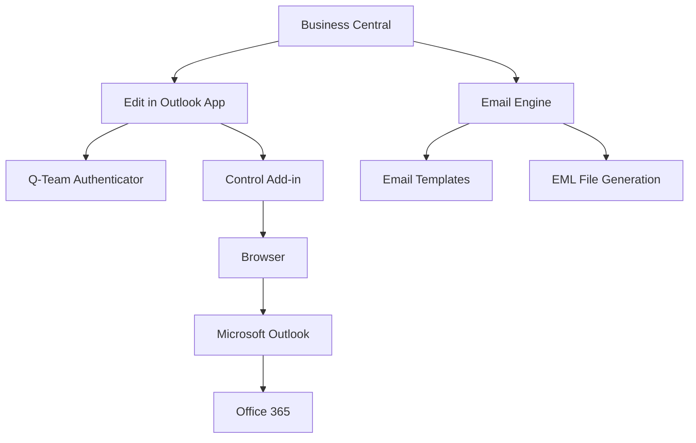
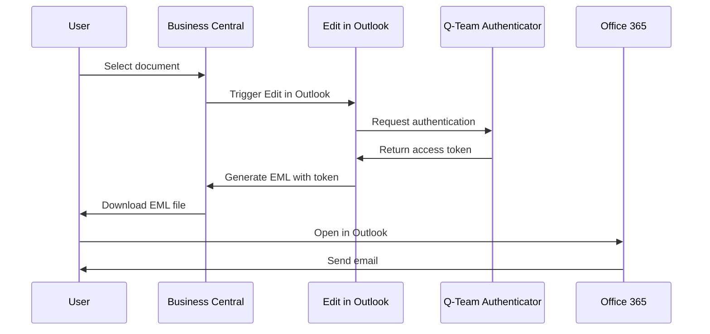

# Architecture

This page describes the technical architecture of the Q-Team Solutions Edit in Outlook app for Microsoft Dynamics 365 Business Central.

## Architecture Overview



## Main Components

### 1. Business Central App
**Location**: `src/` directory
- **App ID**: 0e9ac084-9f49-46d3-b3d1-224b4e7dba0a
- **Publisher**: Q-Team Solutions
- **Version**: 27.0.46066.0
- **Platform**: Business Central 27.0+

#### Codeunits
| Codeunit | Function |
|----------|---------|
| `EIOEmailFunctions` | Core email functionality and EML generation |
| `QTEAMEditinOutlookSubs` | Business Central event subscribers |
| `QTEAMEIOAppSetup` | App configuration and setup |
| `QTEAMEmailMessageImpl` | Email message implementation |
| `QTEAMEntitlementManagement` | License and rights management |

#### Control Add-ins
| Add-in | Purpose |
|--------|---------|
| `QTEAMDropAreaControl` | Drag-and-drop functionality |
| `QTEAMEditInOutlookControlAdd` | Main interface |
| `QTEAMEmailDataControlAdd` | Email data manipulation |
| `QTEAM_PDFViewer` | PDF preview functionality |

### 2. Dependencies

#### Q-Team App Authenticator
- **Required Dependency**: Q-Team App Authenticator (version 27.0.46044.0)
- **Function**: Secure authentication and authorization
- **Integration**: Token-based authentication for API calls

### 3. Client-Side Architecture

#### JavaScript Components
**Location**: `js/` directory

| File | Function |
|------|---------|
| `edit.js` | Main functionality for email editing |
| `EmailData.js` | Email data objects and manipulation |
| `EmailDataStartup.js` | Email data initialization |
| `script.js` | General utility functions |
| `DropArea.js` | Drag-and-drop implementation |
| `startup.js` | App initialization |

#### CSS Styling
**Location**: `css/` directory
- `DropArea.css`: Styling for drag-and-drop interface

### 4. Email Workflow Architecture

#### Process Flow
1. **Initiation**: User activates "Edit in Outlook" from Business Central document
2. **Template Retrieval**: System retrieves relevant email template
3. **EML Generation**: Creation of .eml file with document and template
4. **Browser Download**: File is downloaded to user's system
5. **Outlook Integration**: User opens .eml file in Outlook
6. **Editing**: User edits email in Outlook interface
7. **Sending**: Email is sent via Outlook/Office 365

#### EML File Structure
```
EML File
├── Headers (To, From, Subject, etc.)
├── Body (HTML/Plain text)
├── Attachments
│   ├── PDF Document
│   └── Additional files
└── Metadata
```

### 5. Integration Events

The app provides various Integration Events for extensibility:

#### OnBeforeGenerateEML
- **Trigger**: Before EML generation
- **Use case**: Custom validation or preprocessing

#### OnAfterGenerateEML  
- **Trigger**: After EML generation
- **Use case**: Logging, archiving, postprocessing

#### Warehouse Shipment Events
- Specific events for warehouse shipment documents
- Support for complex document flows

### 6. Security Architecture

#### Authentication Flow


#### Permissions & Access Rights
- **Permission Sets**: Defined in `src/permissionset/`
- **Entitlements**: Controlled via `QTEAMEntitlementManagement`
- **User Rights**: Respects Business Central user permissions

### 7. Deployment Architecture

#### Multi-Platform Support
- **SaaS**: Via AppSource deployment
- **On-Premise**: Via .app file installation
- **Hybrid**: Supports both scenarios

#### Versioning
- **App versioning**: Semantic versioning (Major.Minor.Build.Revision)
- **Compatibility**: Backward compatibility with Business Central updates
- **Update mechanism**: Automatic updates for SaaS

### 8. Performance & Scalability

#### Optimizations
- **Lazy Loading**: Control add-ins loaded only when needed
- **Caching**: Templates and configuration are cached
- **Batch Processing**: Support for bulk operations

#### Resource Management
- **Memory**: Efficient use of browser memory
- **Network**: Minimal API calls to Business Central
- **Storage**: Local storage of temporary files

### 9. Error Handling

#### Client-Side
- JavaScript error handling in control add-ins
- Fallback mechanisms for browser compatibility
- User-friendly error messages

#### Server-Side
- AL error handling in codeunits
- Integration event error management
- Logging to Application Insights

#### Monitoring
- **Application Insights**: Telemetry and error tracking
- **Performance counters**: Response time monitoring
- **Usage analytics**: Usage statistics

---

**Next steps:**
- [Installation](../installation/installation-overview.md) - Setup instructions
- [API Documentation](../integration/api-overview.md) - Developer information