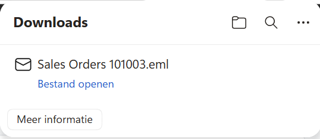

# Edytowanie wiadomości e-mail

Ta strona opisuje, jak używać Edit in Outlook do edytowania i wysyłania wiadomości e-mail dotyczących dokumentów Business Central za pośrednictwem Microsoft Outlook.

## Podstawowy przepływ pracy

### Proces krok po kroku

#### 1. Wybór dokumentu
1. **Otwórz dokument Business Central** (np. oferta sprzedaży, faktura, zamówienie)
2. **Kliknij „Wyślij e-mail"** na wstążce
3. **Otwiera się okno dialogowe e-mail**

#### 2. Aktywacja Edit in Outlook
1. **W oknie dialogowym e-mail**:
   - Wybierz odbiorców
   - Wybierz szablon wiadomości e-mail (opcjonalnie)
   - **Kliknij „Edytuj w programie Outlook"**
2. **Przeglądarka rozpoczyna pobieranie** pliku .eml
3. **Poczekaj na zakończenie pobierania**

#### 3. Edytowanie w programie Outlook
1. **Otwórz pobrany plik .eml** (podwójne kliknięcie)
2. **Program Outlook otwiera się** z wstępnie wypełnioną wiadomością e-mail:
   - Dokument jako załącznik PDF
   - Treść szablonu w treści wiadomości e-mail
   - Informacje o odbiorcy wypełnione
3. **Edytuj wiadomość e-mail** według potrzeb:
   - Dostosuj temat
   - Dodaj tekst osobisty
   - Dodaj dodatkowe załączniki
   - Dostosuj formatowanie

#### 4. Wysyłanie
1. **Przejrzyj wiadomość e-mail**
2. **Kliknij „Wyślij"** w programie Outlook
3. **Wiadomość e-mail jest wysyłana** za pośrednictwem Twojego osobistego konta Outlook
4. **Wiadomość e-mail pojawia się** w folderze Outlook „Elementy wysłane"

## Obsługiwane dokumenty

### Dokumenty sprzedaży
| Typ dokumentu | Strona Business Central | Dostępne akcje |
|---------------|------------------------|----------------|
| **Oferty sprzedaży** | Oferta sprzedaży (41, 42, 43) | Wyślij e-mail → Edytuj w programie Outlook |
| **Zamówienia sprzedaży** | Zamówienie sprzedaży (44, 45, 46) | Wyślij e-mail → Edytuj w programie Outlook |
| **Faktury sprzedaży** | Faktura sprzedaży (132, 133, 134) | Wyślij e-mail → Edytuj w programie Outlook |
| **Zaksięgowane faktury sprzedaży** | Zaksięgowana faktura sprzedaży (132) | Wyślij e-mail → Edytuj w programie Outlook |
| **Faktury korygujące sprzedaży** | Faktura korygująca sprzedaży (114, 115) | Wyślij e-mail → Edytuj w programie Outlook |

### Dokumenty zakupu
| Typ dokumentu | Strona Business Central | Dostępne akcje |
|---------------|------------------------|----------------|
| **Oferty zakupu** | Oferta zakupu (49, 50, 51) | Wyślij e-mail → Edytuj w programie Outlook |
| **Zamówienia zakupu** | Zamówienie zakupu (52, 53, 54) | Wyślij e-mail → Edytuj w programie Outlook |
| **Faktury zakupu** | Faktura zakupu (122, 123, 124) | Wyślij e-mail → Edytuj w programie Outlook |
| **Faktury korygujące zakupu** | Faktura korygująca zakupu (124, 125) | Wyślij e-mail → Edytuj w programie Outlook |

### Dokumenty magazynowe
| Typ dokumentu | Strona Business Central | Dostępne akcje |
|---------------|------------------------|----------------|
| **Wydania magazynowe** | Wydanie magazynowe (7337) | Wyślij e-mail → Edytuj w programie Outlook |
| **Zaksięgowane wydania magazynowe** | Zaksięgowane wydanie magazynowe (7348) | Wyślij e-mail → Edytuj w programie Outlook |

## Interfejs użytkownika

### Okno dialogowe e-mail Business Central
Po wybraniu „Wyślij e-mail" zobaczysz:


### Monit pobierania Edit in Outlook
Po kliknięciu „Edytuj w programie Outlook":



### Okno tworzenia wiadomości Outlook
Plik .eml otwiera się w programie Outlook z:

```
┌─ Nowa wiadomość - Outlook ──────────────────┐
│ Od: twoj-email@firma.pl                     │
│ Do: klient@przyklad.pl                      │
│ Temat: Oferta sprzedaży OS001               │
│                                             │
│ ┌─────────────────────────────────────────┐ │
│ │ Szanowny Kliencie,                      │ │
│ │                                         │ │
│ │ W załączeniu przesyłamy ofertę OS001.  │ │
│ │                                         │ │
│ │ Z poważaniem,                           │ │
│ │ [Twoje imię i nazwisko]                 │ │
│ └─────────────────────────────────────────┘ │
│                                             │
│ Załączniki: 📎 OfertaSprzedazy_OS001.pdf  │
│                                             │
│ [Wyślij] [Zapisz wersję roboczą] [Odrzuć]  │
└─────────────────────────────────────────────┘
```

## Funkcje edycji wiadomości e-mail

### Korekty tekstu
W programie Outlook możesz:
- **Zmienić temat**
- **Dostosować treść wiadomości**:
  - Dodać osobistą notatkę
  - Zmodyfikować tekst szablonu
  - Dostosować formatowanie (pogrubienie, kursywa, kolory)
  - Dodać listy
  - Wstawiać łącza

### Zarządzanie załącznikami
- **Wyświetlać istniejące załączniki** (dokument PDF)
- **Dodawać dodatkowe załączniki**:
  - Dodatkowe dokumenty
  - Obrazy
  - Specyfikacje
  - Umowy
- **Usuwać załączniki** (w razie potrzeby)
- **Zmieniać nazwy załączników**

### Dostosowywanie odbiorców
- **Rozszerzać pole Do** o dodatkowych odbiorców
- **Dodawać odbiorców DW**
- **UDW dla ukrytych kopii**
- **Sprawdzać poprawność adresów** w książce adresowej programu Outlook

### Podpis i formatowanie
- **Podpis osobisty** jest dodawany automatycznie
- **Identyfikacja wizualna firmy** zachowana z szablonu
- **Formatowanie HTML** w pełni dostępne
- **Edycja tekstu sformatowanego** za pomocą edytora programu Outlook

## Zaawansowane funkcje

### Personalizacja szablonu
Dostosowuj szablony do sytuacji:

```html
<!-- Przed wysłaniem -->
<p>Szanowny/a %CUSTOMER_NAME%,</p>
<p>W załączeniu przesyłamy %DOCUMENT_TYPE% %DOCUMENT_NO%.</p>

<!-- Po edycji w programie Outlook -->
<p>Szanowny Panie Kowalski,</p>
<p>W nawiązaniu do naszej dzisiejszej rozmowy, w załączeniu
przesyłamy zaktualizowaną ofertę sprzedaży OS001 z nowymi cenami.</p>
```

### Masowa edycja wiadomości e-mail
Dla wielu dokumentów:
1. **Użyj Edit in Outlook** dla pierwszego dokumentu
2. **Zapisz jako szablon** w programie Outlook
3. **Zastosuj szablon** do kolejnych dokumentów
4. **Spersonalizuj** każdą wiadomość

**Zobacz też:** [Obsługiwane wersje](supported-versions.md) | [Ograniczenia](limitations.md)
